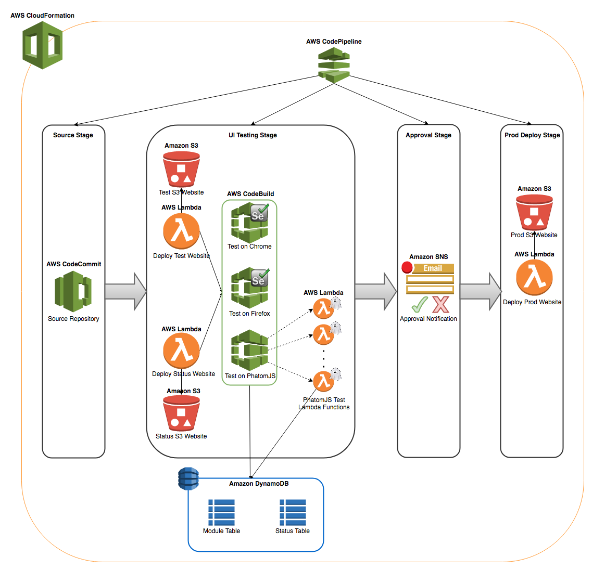
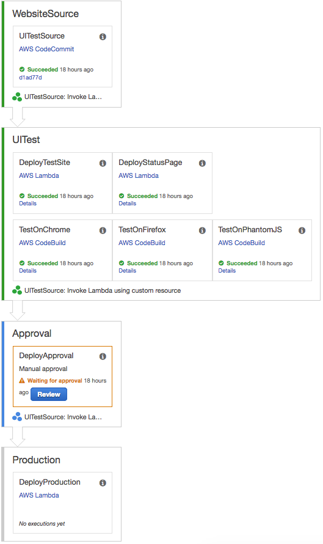

# Serverless-Automated-UI-Testing

Copyright 2017 Amazon.com, Inc. or its affiliates. All Rights Reserved.
SPDX-License-Identifier: MIT-0

***

UI Testing is one of the important part of SDLC. This repo contains sample website which can be hosted as S3 website. AWS CodeBuild has been used to perform the Automated UI testing using Selenium Webdriver on Firefox and Chrome. AWS CodeBuild also have been used to trigger asyncronous headless UI testing on PhantomJS using AWS Lambda. AWS CodePipeline have been used to orchestrate the Continuous Delivery pipeline with multiple stages such as Source, UI Testing, Approval & Production Deployment. This repo contains the CloudFormtaion template which will create the CodePipeline and the corresponding resources (AWS CodeCommit repository needs to be created manually and files should be commited).

Details about using this repo is detailed in the blog post.

***



Let's start by creating the repository and enabling Continuous Delivery pipeline for automated UI testing.


## Step 1:

### Creating CodeCommit repository
Create a CodeCommit repository as mentioned below.

```bash
aws codecommit create-repository --repository-name automated-ui-testing --repository-description "Repository for Automated UI Testing and Continuous Delivery using CodePipeline."
```

Once the CodeCommit repository has been created, clone this GitHub repository and upload the content to  `automated-ui-testing`.


## Step 2:

### Update CloudFormation parameters configuration file
There is a JSON (*CloudFormation Configuration*) file in the repo.

**[automated-ui-testing-params.json](automated-ui-testing-params.json):** - CloudFormation parameter configuration file for Continuous Delivery Pipeline.

Update the configuration file with appropriate values for *SourceRepo, ApprovalTopic, ProductionBucket* based on the requirement.


## Step 3:

### Creating CodePipeline using CloudFormation

Once the configuration file has been updated, execute the following command to create the CloudFormation stack which will create the required CodePipeline.

```bash
aws cloudformation create-stack --stack-name automated_ui_testing --template-body file://automated-ui-testing.yaml --parameters file://automated-ui-testing-params.json --capabilities CAPABILITY_NAMED_IAM
```

Once the CloudFormation successfully creates the stack, it would have created a CodePipeline with similar stages as shown below.



_Note: While deleting, the CloudFormation will retain the S3 buckets it has created. If not needed, the buckets created by CloudFormation will contian the stack name as part of bucket name, identify those buckets and delete them._
